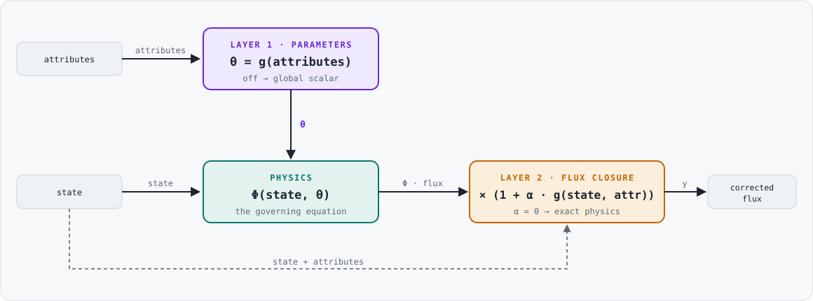
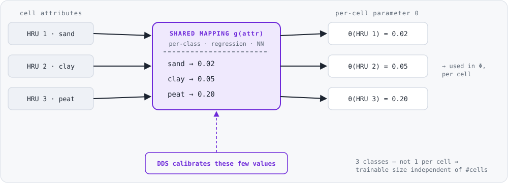
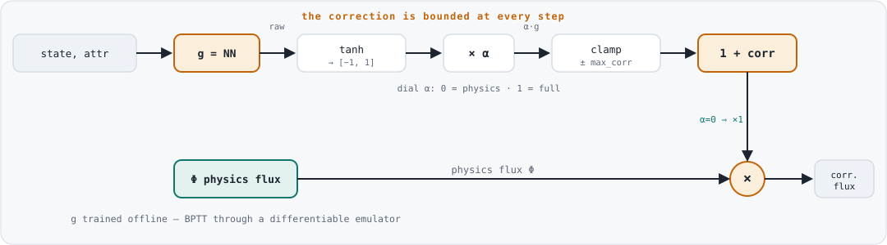

Hybrid Physics–ML
==================================

OpenWQ supports **hybrid physics–machine-learning** simulations: the governing
biogeochemical and sorption equations remain in place, and machine-learning
components are layered on top under explicit user control. Every ML component is
**opt-in and switchable**, and the model reduces **exactly** to the traditional,
purely physical OpenWQ when the components are turned off. This lets users decide
both *whether* to use ML and *how much* to rely on it.

The design follows two complementary approaches from the differentiable-modelling
literature: parameter learning / regionalization (in the spirit of differentiable
parameter learning, dPL) and bounded, learned flux closures (in the spirit of
process-error correction).

Guiding principles
~~~~~~~~~~~~~~~~~~~

* **Physics-first, ML opt-in.** ML is never on by default. A parameter stays a
  global scalar and a flux stays purely physical unless a block explicitly
  enables an ML component.
* **Exact physics recovery.** With every ML dial off the result is *byte-identical*
  to the traditional model — the ML layers add capability without changing the
  baseline.
* **Bounded trainable dimension.** Learned parameters are produced by a small,
  *shared* mapping (per-class values, regression coefficients, or a small neural
  network), so the number of calibrated quantities is independent of the number
  of cells/HRUs. This avoids the ``N_cells × N_params`` explosion of free per-cell
  calibration and is what makes regionalization tractable.
* **Inference in C++, training in Python.** OpenWQ only *evaluates* trained
  networks (a hand-rolled Armadillo MLP — no external ML runtime). Training is
  done offline in Python and the trained weights are exported to JSON.

The three layers
~~~~~~~~~~~~~~~~~

.. list-table::
   :header-rows: 1
   :widths: 12 46 42

   * - Layer
     - What ML controls
     - Off-switch (pure physics)
   * - Layer 0
     - Parameters become per-cell fields (no ML — the foundation)
     - a global scalar (historical behaviour)
   * - Layer 1
     - A mapping sets the per-cell *parameters* (regionalization); the equations
       are unchanged
     - scalar / hand-set map
   * - Layer 2
     - A bounded correction to the *flux* a module produces
     - ``alpha = 0`` recovers the equation exactly

**Layer 1 keeps the physics and learns the knobs; Layer 2 keeps mass balance and
learns the shape of the process.** They are independent switches and may be used
alone, together, or not at all.

   Where each layer plugs into the flux computation. The physics block runs
   unchanged: Layer 1 sets the parameter :math:`\theta` going *in*, and Layer 2
   multiplies the flux coming *out*. Remove Layer 1 and :math:`\theta` is a
   global scalar; set :math:`\alpha = 0` and the Layer-2 factor is 1.

.. _layer0:

Layer 0 — Spatial parameters
~~~~~~~~~~~~~~~~~~~~~~~~~~~~~~

Any calibratable parameter in the ``NATIVE_BGC_FLEX`` reaction kinetics or in the
sorption isotherms (Freundlich/Langmuir) can be either a **global scalar** (the
default, identical for every cell) or a **per-cell spatial field**. This is the
foundation the ML layers write into, and it is useful on its own — a user can set
per-HRU parameters from a soil/land-cover map with no ML involved.

A parameter value in the configuration is read as follows:

* a plain number → **global scalar** (backward-compatible);
* ``{"UNIFORM": v}`` → **spatial**, every cell set to ``v`` (equivalent to the
  scalar, useful as a validation control);
* ``{"DEFAULT": d, "CELLS": [[icmp, ix, iy, iz, v], ...]}`` (``ix, iy, iz``
  one-based like every other openWQ cell index and the output's
  ``xyz_elements``; ``icmp`` = 0-based compartment index; ``-1`` in
  ``icmp``/``iy``/``iz`` is a wildcard = *every* compartment / column / layer,
  which is what the calibration tools write: one row per spatial unit column
  ``[-1, ix, iy, -1, v]`` so a SUMMA HRU gets the value in all its soil layers
  and in the runoff/aquifer/snow compartments alike) → **spatial**, the
  baseline ``d`` everywhere and the listed internal cells set to ``v``.

The **source/sink load scale** (master file ``OPENWQ_INPUT > SINK_SOURCE_ML >
ML_SCALE``) is the same kind of parameter applied as a per-cell multiplier on
every source/sink load (1 = the configured loads). It accepts one scale for all
species, or a scale **per species** keyed by species name, ``"*"`` covering the
rest — each value being a number, a ``{DEFAULT, CELLS}`` map or a Layer-1B
``{ML_RUNTIME}`` block:

.. code-block:: json

    "SINK_SOURCE_ML": {
        "ML_SCALE": { "NO3-N": { "DEFAULT": 1.0, "CELLS": [[-1, 12, 1, -1, 1.8]] },
                      "NH4-N": 0.7,
                      "*": 1.0 }
    }

In the calibration report the Layer-1 parameter list offers
``SINK_SOURCE:load_scale`` (all species) and ``SINK_SOURCE:load_scale:<species>``
(that species' loads only); the tools merge the chosen rows into this form.

Example (a BGC rate constant made spatial):

.. code-block:: json

    "PARAMETER_VALUES": {
        "beta_min": { "DEFAULT": 0.0003,
                      "CELLS": [[0, 12, 0, 0, 0.001],
                                [0, 13, 0, 0, 0.001]] }
    }

The ``(icmp, ix, iy, iz)`` indices are the host model's internal compartment/cell
indices; the calibration ``ReachMapper`` (see below) converts the familiar
reach/HRU identifiers to these indices for you.

.. _layer1:

Layer 1 — Parameter regionalization
~~~~~~~~~~~~~~~~~~~~~~~~~~~~~~~~~~~~~

Layer 1 learns a **mapping from static cell attributes to physical parameters**,
``theta = g(attributes)``, and writes the resulting per-cell field into the
parameter (Layer 0). The equations are untouched; only *where on the parameter
axis* each cell sits is learned.

   Each cell's attributes are routed through a single *shared* mapping that
   returns that cell's parameter :math:`\theta` — so every cell can differ, yet
   the optimizer tunes only the handful of values inside the mapping (here, three
   per-class values), independent of the number of cells. Switched off, every
   cell falls back to one global scalar.

**Global-by-default, per-parameter opt-in.** Only parameters that are genuinely
*effective* (absorbing unresolved sub-grid heterogeneity — e.g. mineralization or
denitrification rates tied to soil properties) should be regionalized. Truly
universal constants (stoichiometry, thermodynamic constants) stay global.

A parameter is regionalized by adding an ``ML_REGIONALIZE`` block to its entry in
the parameter metadata (``_PARAMETERS_INFO`` for BGC, or the sorption parameter
database). Two "rungs" are available, both calibratable with the existing DDS
optimizer:

* ``per_class`` — one value per attribute class (e.g. soil class). Trainable = one
  value per class.
* ``regression`` — ``theta = intercept + sum_k coeff_k · attribute_k``. Trainable =
  a handful of coefficients.

.. code-block:: json

    "_PARAMETERS_INFO": {
        "beta_min": {
            "VALUE": 0.0003,
            "ML_REGIONALIZE": {
                "rung": "per_class",
                "attribute": "soil_class",
                "default": 0.0003,
                "attribute_table": "openwq_in/attributes.csv",
                "mapping_source": "openwq_out/HDF5/...main.h5",
                "classes": { "sand": [1e-4, 1e-2],
                             "clay": [1e-4, 1e-2],
                             "peat": [1e-3, 5e-2] }
            }
        }
    }

During calibration this single declaration is **expanded into low-dimensional DDS
sub-parameters** (one per class or coefficient). Each evaluation the optimizer
proposes the low-dimensional values, the mapping is applied to build the per-cell
field, and the field is written into the configuration — so regionalized
parameters are calibrated end-to-end with the standard DDS machinery. The
per-class/coefficient count is fixed and independent of the number of cells.

**Mode A vs Mode B.** In **Mode A** (offline bake) the mapping is evaluated in
Python and the resulting :ref:`spatial map <layer0>` is written into the
configuration — no additional C++ is required. In **Mode B** (runtime inference)
OpenWQ evaluates the trained network itself at start-up to fill the field, via an
``ML_RUNTIME`` block that references the network weights and per-cell attributes
(both in separate files):

.. code-block:: json

    "beta_min": {
        "ML_RUNTIME": {
            "WEIGHTS_FILEPATH": "openwq_in/beta_min_net.json",
            "ATTRIBUTES_FILEPATH": "openwq_in/beta_min_attr.json",
            "DEFAULT": 0.0003
        }
    }

.. _layer2:

Layer 2 — Learned flux closures
~~~~~~~~~~~~~~~~~~~~~~~~~~~~~~~~~

Layer 2 corrects the **process itself** — the flux a module produces — for
*structural* error that no parameter value can fix (a missing control, or a wrong
functional form). The physics flux is multiplied by a **bounded** learned factor:

.. math::

    y = \Phi_{\mathrm{physics}}(\mathrm{state}, \theta)\,\bigl(1 + \alpha \, g(\mathrm{inputs})\bigr)

where :math:`g` is a small neural network bounded to :math:`[-1, 1]`, and
:math:`\alpha` is the user's dial. At :math:`\alpha = 0` the governing equation is
recovered **exactly**. The total correction :math:`\alpha g` is additionally
clamped to :math:`\pm\,\mathrm{max\_correction}`, so the learned term can *nudge*
a flux but never flip its sign or replace mass conservation.

   The learned correction is squashed to :math:`[-1, 1]` by ``tanh``, scaled by
   the dial :math:`\alpha`, and clamped to :math:`\pm\,\mathrm{max\_correction}`
   before it becomes a multiplier on the physics flux :math:`\Phi`. Every stage is
   bounded, so the closure can only *reshape* a flux within a fixed envelope; at
   :math:`\alpha = 0` the multiplier is exactly 1.

Closures are available for the reaction fluxes (``NATIVE_BGC_FLEX``, per
transformation), the sorption fluxes (Freundlich/Langmuir), and the erosion fluxes
(HYPE-HBVSED and HYPE-MMF). A closure is enabled by adding an ``ML_CLOSURE`` block
to the relevant module/transformation. The trained network lives in a **separate
weights file** referenced by ``WEIGHTS_FILEPATH``:

.. code-block:: json

    "ML_CLOSURE": {
        "ALPHA": 0.3,
        "MAX_CORRECTION": 0.5,
        "WEIGHTS_FILEPATH": "openwq_in/denit_closure.json"
    }

.. note::

   The weights are kept in a separate file because OpenWQ's configuration loader
   upper-cases keys and string values and cannot carry a nested network inline;
   ``*FILEPATH`` values are left untouched, so the referenced file is loaded
   verbatim. ``ALPHA = 0`` (or an absent block) means pure physics — there is no
   on/off flag.

Training the closures (differentiable emulator)
~~~~~~~~~~~~~~~~~~~~~~~~~~~~~~~~~~~~~~~~~~~~~~~~~

Because the closure sits *inside* the flux, its gradient runs through the physics.
Training therefore uses a **differentiable emulator**: a module's flux is
re-implemented in a differentiable form, the corrected system is unrolled in time,
and the trajectory error is back-propagated (back-propagation through time) into
the network's weights. Training is done offline in Python; OpenWQ performs
inference only.

To avoid the two ML layers trading off against each other, train them **in
stages**: fit Layer 1 first, freeze it, then train Layer 2 on the residual
structural error.

Supporting scripts
~~~~~~~~~~~~~~~~~~~

The Python helpers live in ``supporting_scripts/3_Calibration/calibration_lib``:

* ``ml_regionalization.py`` — build the per-cell regionalization maps (Layer 1,
  Mode A), export a runtime network (Mode B), expand an ``ML_REGIONALIZE`` block
  into DDS sub-parameters, and load attribute tables.
* ``ml_closure_train.py`` — the differentiable emulator and back-propagation-
  through-time trainer for Layer 2 closures, with a pluggable physics ``step`` and
  a finite-difference gradient check; exports the trained network to the
  ``ML_CLOSURE`` weights file.

The regionalized parameters integrate with the standard calibration workflow (see
:doc:`Calibration <4_2_2_Calibration>`); the calibration setup report lists each
regionalized parameter with its rung, attribute, and sub-parameters.

Chained (multi-model) calibration
~~~~~~~~~~~~~~~~~~~~~~~~~~~~~~~~~~~

All three layers work in a **chained** calibration (e.g. SUMMA-OpenWQ →
mizuRoute-OpenWQ; see :doc:`Calibration <4_2_2_Calibration>`). Each chain model
carries its own configuration, so Layer-2 closures and Layer-1 Mode-B runtime
networks are simply part of that model's config and run per model automatically.
For Layer-1 regionalization under calibration, a regionalized parameter is
expanded into DDS sub-parameters that are tagged with their model position; the
chain handler routes each model's sub-parameters (and their attribute table and
reach mapping, resolved within that model's run directory) to that model, so the
per-cell map is built and written into the correct model's configuration each
evaluation. Because every model has its own attribute table and reach mapping,
the same parameter can be regionalized independently in different chain models.
